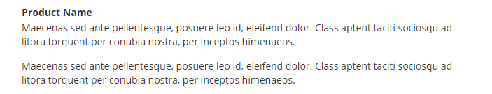
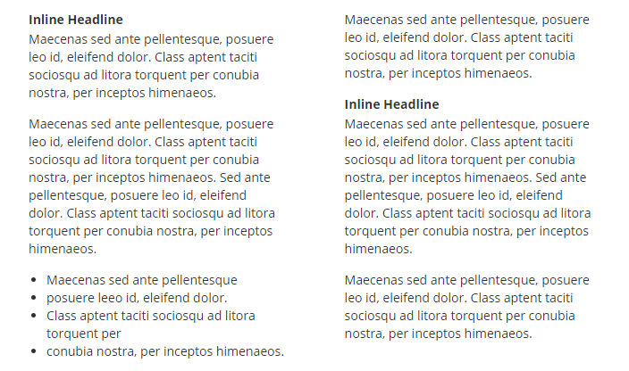

# Introduction

Welcome to the FARO Standard and Vertical E-mail Marketing Template documentation.

This documentation covers the basic e-mail template, header, footer, and contains snippets of various content layouts.

# MJML Overview

This template utilizes the MJML language, which takes a lot of the tedious HTML editing out of creating e-mails that work in as many e-mail clients as possible.

In order to send an e-mail created in MJML, you must first convert it into HTML using an MJML interpreter. There are two basic ways to do this:

* Use the **[MJML Website](https://mjml.io/try-it-live)** to convert your MJML code into HTML code in real time.
* Use the **[MJML Desktop App](https://mjmlio.github.io/mjml-app/)** to convert your MJML code into HTML code in real time on your desktop (without the need for an Internet connection).

When using either option, for best results, make sure the option to **Minify HTML** is enabled.

* On the **[MJML Website](https://mjml.io/try-it-live)**, this option is located at the top of the screen, above the preview area.
* In the **[MJML Desktop App](https://mjmlio.github.io/mjml-app/)**, this option is located in the settings area.

# Getting Started

## Blank Template

```html
<mjml lang="en">
    <mj-head>
        <mj-preview>FARO: Preview text goes here</mj-preview>
        <mj-breakpoint width="697px" />
        <mj-attributes>
            <!-- core palette -->
            <mj-class name="color__faro-blue" color="#01426a" />
            <mj-class name="color__faro-blue--bg" background-color="#01426a">
                <mj-button background-color="#01426a" />
            </mj-class>
            <mj-class name="color__faro-blue--border" border-color="#01426a">
                <mj-divider border-color="#01426a" />
            </mj-class>
            <mj-class name="color__white" color="#fff" />
            <mj-class name="color__white--bg" background-color="#fff">
                <mj-button background-color="#fff" />
            </mj-class>
            <mj-class name="color__white--border" border-color="#fff">
                <mj-divider border-color="#fff" />
            </mj-class>
            <mj-class name="color__anthracite-gray" color="#2f3234" />
            <mj-class name="color__anthracite-gray--bg" background-color="#2f3234">
                <mj-button background-color="#2f3234" />
            </mj-class>
            <mj-class name="color__anthracite-gray--border" border-color="#2f3234">
                <mj-divider border-color="#2f3234" />
            </mj-class>
            <mj-class name="color__metal-gray" color="#52595d" />
            <mj-class name="color__metal-gray--bg" background-color="#52595d">
                <mj-button background-color="#52595d" />
            </mj-class>
            <mj-class name="color__metal-gray--border" border-color="#52595d">
                <mj-divider border-color="#52595d" />
            </mj-class>
            <mj-class name="color__light-metal-gray" color="#8d9295" />
            <mj-class name="color__light-metal-gray--bg" background-color="#8d9295">
                <mj-button background-color="#8d9295" />
            </mj-class>
            <mj-class name="color__light-metal-gray--border" border-color="#8d9295">
                <mj-divider border-color="#8d9295" />
            </mj-class>
            <mj-class name="color__white-gray" color="#e2e2e2" />
            <mj-class name="color__white-gray--bg" background-color="#e2e2e2">
                <mj-button background-color="#e2e2e2" />
            </mj-class>
            <mj-class name="color__white-gray--border" border-color="#e2e2e2">
                <mj-divider border-color="#e2e2e2" />
            </mj-class>

            <!-- accent palette -->
            <mj-class name="color__zenith-blue" color="#009cde" />
            <mj-class name="color__zenith-blue--bg" background-color="#009cde">
                <mj-button background-color="#009cde" />
            </mj-class>
            <mj-class name="color__zenith-blue--border" border-color="#009cde">
                <mj-divider border-color="#009cde" />
            </mj-class>
            <mj-class name="color__sunny-orange" color="#eaaa00" />
            <mj-class name="color__sunny-orange--bg" background-color="#eaaa00">
                <mj-button background-color="#eaaa00" />
            </mj-class>
            <mj-class name="color__sunny-orange--border" border-color="#eaaa00">
                <mj-divider border-color="#eaaa00" />
            </mj-class>

            <!-- vertical palette -->
            <mj-class name="color__carbon-black" color="#000" />
            <mj-class name="color__carbon-black--bg" background-color="#000">
                <mj-button background-color="#000" />
            </mj-class>
            <mj-class name="color__carbon-black--border" border-color="#000">
                <mj-divider border-color="#000" />
            </mj-class>
            <mj-class name="color__on-site-orange" color="#ff6a13" />
            <mj-class name="color__on-site-orange--bg" background-color="#ff6a13">
                <mj-button background-color="#ff6a13" />
            </mj-class>
            <mj-class name="color__on-site-orange--border" border-color="#ff6a13">
                <mj-divider border-color="#ff6a13" />
            </mj-class>
            <mj-class name="color__forest-green" color="#4c8c2b" />
            <mj-class name="color__forest-green--bg" background-color="#4c8c2b">
                <mj-button background-color="#4c8c2b" />
            </mj-class>
            <mj-class name="color__forest-green--border" border-color="#4c8c2b">
                <mj-divider border-color="#4c8c2b" />
            </mj-class>
            <mj-class name="color__pursuit-blue" color="#0070c8" />
            <mj-class name="color__pursuit-blue--bg" background-color="#0070c8">
                <mj-button background-color="#0070c8" />
            </mj-class>
            <mj-class name="color__pursuit-blue--border" border-color="#0070c8">
                <mj-divider border-color="#0070c8" />
            </mj-class>
            <mj-class name="color__beaming-red" color="#d50037" />
            <mj-class name="color__beaming-red--bg" background-color="#d50037">
                <mj-button background-color="#d50037" />
            </mj-class>
            <mj-class name="color__beaming-red--border" border-color="#d50037">
                <mj-divider border-color="#d50037" />
            </mj-class>

            <!-- Vertical Tag Styles -->
            <mj-class name="text__vertical-primary"
                      color="#000000"
                      font-size="14px"
                      line-height="14px"
                      font-weight="bold"
                      font-family="'Open Sans', 'Helvetica Neue', Helvetica, sans-serif"
                      text-transform="uppercase"
                      align="right"
                      padding="0px 10px 5px 0px" />
            <mj-class name="text__vertical-secondary"
                      color="#000000"
                      font-size="13px"
                      line-height="13px"
                      font-weight="normal"
                      font-family="'Open Sans', 'Helvetica Neue', Helvetica, sans-serif"
                      align="right"
                      padding="0px 10px 0px 0px" />

            <!-- Call to Action Styles -->
            <mj-class name="text__cta-primary"
                      color="#000000"
                      font-size="32px"
                      line-height="32px"
                      font-weight="normal"
                      font-family="'Open Sans', 'Helvetica Neue', Helvetica, sans-serif"
                      padding="10px 30px" />
            <mj-class name="text__cta-secondary"
                      color="#000000"
                      font-size="23px"
                      line-height="23px"
                      font-weight="normal"
                      font-family="'Open Sans', 'Helvetica Neue', Helvetica, sans-serif"
                      padding="0px 30px" />
            <mj-class name="line__cta-primary"
                      border-color="#000000"
                      border-width="5px"
                      padding="0px 30px 0px 30px"
                      width="85px" />

            <!-- Secondary Headline Styles-->
            <mj-class name="text__headline-secondary"
                      color="#000000"
                      font-size="22px"
                      line-height="22px"
                      font-weight="normal"
                      font-family="'Open Sans', 'Helvetica Neue', Helvetica, sans-serif"
                      align="left"
                      padding="10px 0px" />
            <mj-class name="line__headline-secondary"
                      border-color="#000000"
                      border-width="2px"
                      padding="5px 0px" />

            <!-- Normal/Inline Text Styles -->
            <mj-class name="text__normal-heading"
                      color="#000000"
                      font-size="14px"
                      line-height="20px"
                      font-weight="bold"
                      font-family="'Open Sans', 'Helvetica Neue', Helvetica, sans-serif"
                      align="left"
                      padding="0px 0px 2px 0px" />
            <mj-class name="text__normal"
                      color="#000000"
                      font-size="14px"
                      line-height="20px"
                      font-weight="normal"
                      font-family="'Open Sans', 'Helvetica Neue', Helvetica, sans-serif"
                      align="left"
                      padding="0px 0px 15px 0px" />
            <mj-class name="line__normal"
                      border-color="#000000"
                      border-width="1px"
                      padding="5px 0px" />

            <!-- Image Styles -->
            <mj-class name="image__bordered"
                      border="2px #000000 solid" />

            <!-- Button Styles -->
            <mj-class name="button__primary"
                      border-radius="0px"
                      font-size="19px"
                      line-height="25px"
                      font-weight="bold"
                      font-family="'Open Sans', 'Helvetica Neue', Helvetica, sans-serif"
                      padding="15px 40px" />

            <!-- Template-Specific Styles -->
            <mj-class name="block__grey--faded"
                      background-color="#fff"
                      background-url="http://cpommiss.github.io/faro-email/images/elements/bg-triangles-grey-faded.jpg"
                      border-top="1px #01426a solid"
                      border-bottom="1px #01426a solid"
                      vertical-align="middle" />
        </mj-attributes>
        <mj-style>
            .divider-left {
                display: inline-block;
                text-align: left;
            }
            .divider-left p {
                display: inline-block;
            }
            .button-full a {
                display: block !important;
            }
            @media screen and (min-width: 697px) {
                .vertical-header > table > tbody > tr > td {
                    padding-left: 0 !important;
                    padding-right: 0 !important;
                }
            }
        </mj-style>
        <!--[if gte mso 9]>
        <style>
            li {
                text-indent: -1em;
            }
        </style>
        <![endif]-->
    </mj-head>
    <mj-body width="680px">
    
        <!--*******
            ******* Your content would go here 
            ******* -->
        
    </mj-body>
</mjml>
```

Shown on the right is the blank, boilerplate template that can be used for both standard and vertical-specific e-mail projects.

At the bottom of all the boilerplate code for colors, fonts and styles, is a section of code wrapped by an `<mj-body>` tag. This is where you can cut/paste your content from the snippets in this guide.

# Quick-Start Templates

### Standard FARO Template

You can download a quick-start Standard FARO MJML template with all the bells-and-whistles **[here](downloads/basic.zip)**.

### Vertical-Specific Template

You can download a quick-start Vertical-Specific FARO MJML template with all the bells-and-whistles **[here](downloads/vertical.zip)**.

# Colors

The blank template includes support for the entire FARO brand color palette. These colors are included as CSS class names that can be used when writing MJML code.

In all cases, the snippets found within utilize the FARO Blue color or Athracite Gray color by default, but you can change this to meet your needs (i.e., for a Vertical-specific template).

The colors available are:

### Core Palette

Color Name | Hex Code | Preview | Class Name
--------- | ------- | ----------- | ------------
FARO Blue | #01426A | <div style="background-color: #01426A; margin-top: 4px; width: 60px; height: 14px;"></div> | `color__faro-blue`
White | #FFFFFF | <div style="background-color: #FFFFFF; margin-top: 4px; width: 60px; height: 14px;"></div> | `color__white`
Anthracite Gray | #2F3234 | <div style="background-color: #2F3234; margin-top: 4px; width: 60px; height: 14px;"></div> | `color__anthracite-gray`
Metal Gray | #52595D | <div style="background-color: #52595D; margin-top: 4px; width: 60px; height: 14px;"></div> | `color__metal-gray`
Light Metal Gray | #8D9295 | <div style="background-color: #8D9295; margin-top: 4px; width: 60px; height: 14px;"></div> | `color__light-metal-gray`
White Gray | #E2E2E2 | <div style="background-color: #E2E2E2; margin-top: 4px; width: 60px; height: 14px;"></div> | `color__white-gray`

### Accent Palette

Color Name | Hex Code | Preview | Class Name
--------- | ------- | ----------- | ------------
Zenith Blue | #009CDE | <div style="background-color: #009CDE; margin-top: 4px; width: 60px; height: 14px;"></div> | `color__zenith-blue`
Sunny Orange | #EAAA00 | <div style="background-color: #EAAA00; margin-top: 4px; width: 60px; height: 14px;"></div> | `color__sunny-orange`

### Vertical Palette

Color Name | Hex Code | Preview | Class Name
--------- | ------- | ----------- | ------------
Carbon Black | #000000 | <div style="background-color: #000000; margin-top: 4px; width: 60px; height: 14px;"></div> | `color__carbon-black`
On-Site Orange | #FF6A13 | <div style="background-color: #FF6A13; margin-top: 4px; width: 60px; height: 14px;"></div> | `color__on-site-orange`
Forest Green | #4C8C2B | <div style="background-color: #4C8C2B; margin-top: 4px; width: 60px; height: 14px;"></div> | `color__forest-green`
Pursuit Blue | #0070C8 | <div style="background-color: #0070C8; margin-top: 4px; width: 60px; height: 14px;"></div> | `color__pursuit-blue`
Beaming Red | #D50037 | <div style="background-color: #D50037; margin-top: 4px; width: 60px; height: 14px;"></div> | `color__beaming-red`

### Backgrounds and Borders

For any of the colors listed above, you can add the `--bg` or `--border` suffix to the CSS class name to change the background color of border color of an element (where it is supported) to that color. You will see syntax being used in various snippets.

For example, to change the background color of something that is white to **On-Site Orange**, you would add the `color__on-site-orange--bg` class to the `mj-class` attribute of the element you're trying to change the background color of.

# Icons

If you wish to change the icon being used in a snippet found here, simply change the filename of the icon to the one you want to use shown below.

The following icon filenames are available:

Icon | Image Filename | Description
--------- | ------- | -----------
 | accurate.jpg | Accurate
 | advance-performance.jpg | Advance Performance
 | alert.jpg | Alert
 | anytime.jpg | Anytime
 | capture-in-3d.jpg | Capture In 3d
 | collaboration.jpg | Collaboration
 | compelling-presentation.jpg | Compelling Presentation
 | complete.jpg | Complete
 | direct-comparison.jpg | Direct Comparison
 | easy-repair.jpg | Easy Repair
 | easy-to-process.jpg | Easy To Process
 | easy-to-share-data.jpg | Easy To Share Data
 | easy-to-use.jpg | Easy To Use
 | efficient.jpg | Efficient
 | eliminate-manual-drawings.jpg | Eliminate Manual Drawings
 | eliminate-scrap.jpg | Eliminate Scrap
 | faster.jpg | Faster
 | flexible.jpg | Flexible
 | flexible-capture.jpg | Flexible Capture
 | gentle.jpg | Gentle
 | implementation.jpg | Implementation
 | in-the-field-deliverable.jpg | In The Field Deliverable
 | limit-road-time-closure.jpg | Limit Road Time Closure
 | money-saving.jpg | Money Saving
 | portable.jpg | Portable
 | preserve-evidence.jpg | Preserve Evidence
 | provide-clarity.jpg | Provide Clarity
 | reduce-cost.jpg | Reduce Cost
 | reduce-exposure.jpg | Reduce Exposure
 | reduce-officers.jpg | Reduce Officers
 | reduce-risk.jpg | Reduce Risk
 | reliable.jpg | Reliable
 | reliable-alt.jpg | Reliable (Alternate)
 | reverse-engineering.jpg | Reverse Engineering
 | safe.jpg | Safe
 | standard-catalogs.jpg | Standard Catalogs
 | thorough.jpg | Thorough
 | time-saving.jpg | Time Saving
 | trend-analysis.jpg | Trend Analysis
 | user-control.jpg | User Control
 | verifications.jpg | Verifications
 | wet-and-dark-conditions.jpg | Wet And Dark Conditions

These icons are available in a few different sizes, which are pre-set based on the path of the filename for the icon. For example, the icons located in the `icons/large/blue` path are shown above, and are used in the **[Icon List](#icon-list)** snippet/layout. If you only change the filename as directed, you should not need to worry about the correct pathname for the snippet you're using. 

# Headers

## Basic Logo Header

```html
<mj-wrapper padding="0px">
    <mj-section padding="0px">
        <mj-column width="100%" padding="20px 0px">
            <mj-image width="140px"
                      src="http://cpommiss.github.io/faro-email/images/elements/logo-blue.jpg"
                      alt="FARO Logo"
                      href="https://www.faro.com/" />
        </mj-column>
    </mj-section>
</mj-wrapper>
```
Shown on the right is the MJML code to generate and display a simple, centered FARO logo header.

This code will look like this when rendered:

<aside>

</aside>

### Options and Notes

There are no configuration options for this snippet. Just cut and paste!

## Vertical-Specific Logo Header

```html
<mj-wrapper padding="0px">
    <mj-section padding="0px 10px" css-class="vertical-header">
        <mj-group width="100%">
            <mj-column width="35%" padding="0px" vertical-align="middle">
                <mj-image width="120px"
                          padding="0px"
                          align="left"
                          src="http://cpommiss.github.io/faro-email/images/elements/logo-blue.jpg"
                          alt="FARO Logo"
                          href="https://www.faro.com/" />
            </mj-column>
            <mj-column width="57%" padding="20px 0px 20px 20px" vertical-align="middle">
                <!-- *** START: Vertical Header and Sub-header *** -->
                <mj-text mj-class="text__vertical-primary color__faro-blue">
                    3D Design
                </mj-text>
                <mj-text mj-class="text__vertical-secondary color__carbon-black">
                    Digital Creation
                </mj-text>
                <!-- *** END: Vertical Header and Sub-header *** -->
            </mj-column>
            <mj-column width="8%" padding="0px" vertical-align="middle">
                <!-- *** START: Vertical Image Icon *** -->
                <mj-image padding="0px"
                          width="40px"
                          align="right"
                          src="http://cpommiss.github.io/faro-email/images/elements/vertical/3d-design.jpg"
                          alt="3D Design" />
                <!-- *** END: Vertical Image Icon *** -->
            </mj-column>
        </mj-group>
    </mj-section>
</mj-wrapper>
```
Shown on the right is the MJML code to generate and display a vertical-specific header.

This code will look like this when rendered:

<aside>

</aside>

### Options and Notes

* You can change the color of the any text or elements by changing any `color` CSS classes (i.e., `color__faro-blue` ) anywhere you see them in this snippet. For a list of CSS color classes, refer to the **[Colors](#colors)** section of this documentation.
* You'll need to specify the header and sub-header for the vertical, as well as the proper vertical icon.

The following vertical icons are available:

Icon | Image Filename | Description
--------- | ------- | -----------
 | 3d-design.jpg | 3D Design
 | construction.jpg | Construction
 | manufacturing.jpg | Manufacturing
 | photonics.jpg | Photonics
 | public-safety.jpg | Public Safety

You can find the proper places to change the image filename and the vertical header/sub-header annotated with HTML comments in the code shown on the right.

# Footers

## Social Media Footer

```html
<mj-wrapper padding="10px 0px">
    <mj-section padding="0px">
        <mj-column width="100%" padding="0px">
            <mj-social icon-size="35px"
                       mode="horizontal">
                <mj-social-element padding="0px"
                                   name="facebook"
                                   href="https://www.facebook.com/FAROTechnologies"
                                   background-color="#ffffff"
                                   src="http://cpommiss.github.io/faro-email/images/elements/icons/social/fb_round.png"
                                   alt="Facebook">
                </mj-social-element>
                <mj-social-element padding="0px"
                                   name="twitter"
                                   href="https://twitter.com/faro_hq"
                                   background-color="#ffffff"
                                   src="http://cpommiss.github.io/faro-email/images/elements/icons/social/tw_round.png"
                                   alt="Twitter">
                </mj-social-element>
                <mj-social-element padding="0px"
                                   name="linkedin"
                                   href="https://www.linkedin.com/company/faro-technologies"
                                   background-color="#ffffff"
                                   src="http://cpommiss.github.io/faro-email/images/elements/icons/social/ln_round.png"
                                   alt="LinkedIn">
                </mj-social-element>
                <mj-social-element padding="0px"
                                   name="feed"
                                   href="https://insights.faro.com/"
                                   background-color="#ffffff"
                                   src="http://cpommiss.github.io/faro-email/images/elements/icons/social/feed_round.png"
                                   alt="Feed/RSS">
                </mj-social-element>
            </mj-social>
        </mj-column>
    </mj-section>
</mj-wrapper>
```
Shown on the right is the MJML code to generate and display a simple, social media footer.

This code will look like this when rendered:

<aside>

</aside>

### Options and Notes

There are no configuration options for this snippet. Just cut and paste!

# Headlines

## Basic

```html
<mj-wrapper padding="10px 0px">
    <mj-section padding="0px">
        <mj-column width="100%" padding="0px">
            <!-- *** START: Headline Text *** -->
            <mj-text mj-class="text__headline-secondary color__faro-blue"
                     align="left">
                Headline Text
            </mj-text>
            <!-- *** END: Headline Text *** -->
        </mj-column>
    </mj-section>
</mj-wrapper>
```
Shown on the right is the MJML code to generate and display a basic headline.

This code will look like this when rendered:

<aside>

</aside>

### Options and Notes

You can change the `align` attribute on the `mj-text` tag to be either `left`, `right`, or `center` to change the text alignment of the headline.

## Centered with Line

```html
<mj-wrapper padding="10px 0px">
    <mj-section padding="0px">
        <mj-column width="100%" padding="0px">
            <!-- *** START: Headline Text *** -->
            <mj-text mj-class="text__headline-secondary color__faro-blue"
                     align="center">
                Headline Text
            </mj-text>
            <!-- *** END: Headline Text *** -->

            <mj-divider mj-class="line__headline-secondary color__zenith-blue--border"
                        width="95px" />
        </mj-column>
    </mj-section>
</mj-wrapper>
```
Shown on the right is the MJML code to generate and display a centered headline.

This code will look like this when rendered:

<aside>

</aside>

### Options and Notes

* You can change the color of the any text or elements by changing any `color` CSS classes (i.e., `color__faro-blue` ) anywhere you see them in this snippet. For a list of CSS color classes, refer to the **[Colors](#colors)** section of this documentation.
* Due to the fact that this headline has an underline below it, you should not change the `align` attribute on the `mj-text` tag.

## Left-justified with Line

```html
<mj-wrapper padding="10px 0px">
    <mj-section padding="0px">
        <mj-column width="100%" padding="0px">
            <!-- *** START: Headline Text *** -->
            <mj-text mj-class="text__headline-secondary color__faro-blue"
                     padding-left="20px"
                     align="left">
                Headline Text
            </mj-text>
            <!-- *** END: Headline Text *** -->

            <mj-divider mj-class="line__headline-secondary color__zenith-blue--border"
                        css-class="divider-left"
                        padding-left="20px"
                        width="95px" />
        </mj-column>
    </mj-section>
</mj-wrapper>
```
Shown on the right is the MJML code to generate and display a left-justified headline with underline. 

This code will look like this when rendered:

<aside>

</aside>

### Options and Notes

* You can change the color of the any text or elements by changing any `color` CSS classes (i.e., `color__faro-blue` ) anywhere you see them in this snippet. For a list of CSS color classes, refer to the **[Colors](#colors)** section of this documentation.
* Due to the fact that this headline has an underline below it, you should not change the `align` attribute on the `mj-text` tag.

## With Icon

```html
<mj-wrapper padding="10px 0px">
    <mj-section padding="0px">
        <mj-column width="10%" padding="0px">
            <!-- *** START: Headline Icon *** -->
            <mj-image width="52px"
                      height="36px"
                      padding="0px"
                      align="left"
                      src="http://cpommiss.github.io/faro-email/images/elements/icons/header/white/wide/left/capture-in-3d.jpg"
                      alt="Capture in 3D" />
            <!-- *** END: Headline Icon *** -->
        </mj-column>
        <mj-column width="90%" padding="0px">
            <!-- *** START: Headline Text *** -->
            <mj-text padding="6px 20px 20px 20px"
                     mj-class="text__headline-secondary color__faro-blue">
                Headline Text
            </mj-text>
            <!-- *** END: Headline Text *** -->
        </mj-column>
    </mj-section>
</mj-wrapper>
```
Shown on the right is the MJML code to generate and display a left-justified headline with icon. 

This code will look like this when rendered:

<aside>

</aside>

### Options and Notes

* You can change the color of the any text or elements by changing any `color` CSS classes (i.e., `color__faro-blue` ) anywhere you see them in this snippet. For a list of CSS color classes, refer to the **[Colors](#colors)** section of this documentation.
* Refer to the **[Icons](#icons)** section of this documentation to find the icon you're looking for.

## With Icon (Inverted)

```html
<mj-wrapper padding="10px 0px">
    <mj-section padding="0px">
        <mj-column mj-class="color__faro-blue--bg" width="10%" padding="0px 0px 0px 20px">
            <!-- *** START: Headline Icon *** -->
            <mj-image width="32px"
                      height="48px"
                      padding="0px"
                      align="left"
                      src="http://cpommiss.github.io/faro-email/images/elements/icons/header/blue/reliable.jpg"
                      alt="Reliable" />
            <!-- *** END: Headline Icon *** -->
        </mj-column>
        <mj-column mj-class="color__white--bg" width="90%" padding="0px">
            <!-- *** START: Headline Text *** -->
            <mj-text mj-class="text__headline-secondary color__faro-blue"
                     padding="12px 20px 5px 20px">
                Headline Text
            </mj-text>
            <!-- *** END: Headline Text *** -->
        </mj-column>
    </mj-section>
</mj-wrapper>
```
Shown on the right is the MJML code to generate and display a left-justified headline with icon. 

This code will look like this when rendered:

<aside>

</aside>

### Options and Notes

* You can change the color of the any text or elements by changing any `color` CSS classes (i.e., `color__faro-blue` ) anywhere you see them in this snippet. For a list of CSS color classes, refer to the **[Colors](#colors)** section of this documentation.
* Refer to the **[Icons](#icons)** section of this documentation to find the icon you're looking for.

# Top Image/Title

## Single-column

```html
<mj-wrapper mj-class="color__white--bg"
            padding="0px"
            background-url="http://cpommiss.github.io/faro-email/images/elements/cta-triangles-grey.jpg"
            background-size="680px"
            background-repeat="no-repeat">
    <mj-section padding="0px">
        <mj-column width="100%">
            <mj-spacer height="70px" />
        </mj-column>
    </mj-section>

    <mj-section padding="0px">
        <mj-column width="100%" padding="0px">
            <mj-divider mj-class="line__cta-primary color__zenith-blue--border"
                        css-class="divider-left" />

            <!-- *** START: Headline Text *** -->
            <mj-text mj-class="text__cta-primary color__faro-blue">
                Dive Deeper Into Our Solutions
            </mj-text>
            <!-- *** END: Headline Text *** -->

            <!-- *** START: Sub-Headline Text *** -->
            <mj-text mj-class="text__cta-secondary color__metal-gray">
                Subheadline Here
            </mj-text>
            <!-- *** END: Sub-Headline Text *** -->
        </mj-column>
    </mj-section>

    <mj-section padding="0px">
        <mj-column width="100%">
            <mj-spacer height="70px" />
        </mj-column>
    </mj-section>
</mj-wrapper>
```
Shown on the right is the MJML code to generate and display a single-column top image/title. 

This code will look like this when rendered:

<aside>

</aside>

### Options and Notes

* You can change the color of the any text or elements by changing any `color` CSS classes (i.e., `color__faro-blue` ) anywhere you see them in this snippet. For a list of CSS color classes, refer to the **[Colors](#colors)** section of this documentation.

## Two-column

```html
<mj-wrapper mj-class="color__white--bg"
            padding="0px"
            background-url="http://cpommiss.github.io/faro-email/images/elements/cta-triangles-grey.jpg"
            background-size="680px"
            background-repeat="no-repeat">
    <mj-section padding="0px">
        <mj-column width="100%">
            <mj-spacer height="70px" />
        </mj-column>
    </mj-section>

    <mj-section padding="0px">
        <mj-column width="55%" padding="10px 0px">
            <mj-divider mj-class="line__cta-primary color__zenith-blue--border"
                        css-class="divider-left" />

            <!-- *** START: Headline Text *** -->
            <mj-text mj-class="text__cta-primary color__faro-blue"
                     padding-right="0px">
                Dive Deeper Into Our Solutions
            </mj-text>
            <!-- *** END: Headline Text *** -->

            <!-- *** START: Sub-Headline Text *** -->
            <mj-text mj-class="text__cta-secondary color__metal-gray"
                     padding-right="0px">
                Subheadline Here
            </mj-text>
            <!-- *** END: Sub-Headline Text *** -->
        </mj-column>
        <mj-column width="45%" padding="10px 0px">
            <!-- *** START: Image Adjacent to Headline Text *** -->
            <mj-image padding="0px 30px"
                      fluid-on-mobile="true"
                      href="#"
                      src="http://placeimg.com/640/360/any"
                      alt="Hero Image" />
            <!-- *** END: Image Adjacent to Headline Text *** -->
        </mj-column>
    </mj-section>

    <mj-section padding="0px">
        <mj-column width="100%">
            <mj-spacer height="70px" />
        </mj-column>
    </mj-section>
</mj-wrapper>
```
Shown on the right is the MJML code to generate and display a two-column top image/title. 

This code will look like this when rendered:

<aside>

</aside>

### Options and Notes

* You can change the color of the any text or elements by changing any `color` CSS classes (i.e., `color__faro-blue` ) anywhere you see them in this snippet. For a list of CSS color classes, refer to the **[Colors](#colors)** section of this documentation.

# Content Blocks

## One-column Text

```html
<mj-wrapper padding="10px 20px">
    <mj-section padding="0px">
        <mj-column width="100%" padding="0px">
            <!-- *** START: Inline Headline *** -->
            <mj-text mj-class="text__normal-heading color__anthracite-gray">
                Product Name
            </mj-text>
            <!-- *** END: Inline Headline *** -->

            <!-- *** START: Basic Paragraph Content *** -->
            <mj-text mj-class="text__normal color__anthracite-gray">
                Maecenas sed ante pellentesque, posuere leo id, eleifend dolor. Class aptent taciti sociosqu ad litora torquent per conubia nostra, per inceptos himenaeos.
            </mj-text>
            <!-- *** END: Basic Paragraph Content *** -->

            <!-- *** START: Basic Paragraph Content *** -->
            <mj-text mj-class="text__normal color__anthracite-gray">
                Maecenas sed ante pellentesque, posuere leo id, eleifend dolor. Class aptent taciti sociosqu ad litora torquent per conubia nostra, per inceptos himenaeos.
            </mj-text>
            <!-- *** END: Basic Paragraph Content *** -->
        </mj-column>
    </mj-section>
</mj-wrapper>
```
Shown on the right is the MJML code to generate and display a one-column layout containing paragraph content.

This code will look like this when rendered:

<aside>

</aside>

### Options and Notes

* You can change the color of the any text or elements by changing any `color` CSS classes (i.e., `color__faro-blue` ) anywhere you see them in this snippet. For a list of CSS color classes, refer to the **[Colors](#colors)** section of this documentation.

## Two-Column Text

```html
<mj-wrapper padding="10px 0px">
    <mj-section padding="0px">
        <mj-column width="48%" padding="0px 20px">
            <!-- *** START: Inline Headline *** -->
            <mj-text mj-class="text__normal-heading color__anthracite-gray">
                Inline Headline
            </mj-text>
            <!-- *** END: Inline Headline *** -->

            <!-- *** START: Basic Paragraph Content *** -->
            <mj-text mj-class="text__normal color__anthracite-gray">
                Maecenas sed ante pellentesque, posuere leo id, eleifend dolor. Class aptent taciti sociosqu ad litora torquent per conubia nostra, per inceptos himenaeos.
            </mj-text>
            <!-- *** END: Basic Paragraph Content *** -->

            <!-- *** START: Basic Paragraph Content *** -->
            <mj-text mj-class="text__normal color__anthracite-gray">
                Maecenas sed ante pellentesque, posuere leo id, eleifend dolor. Class aptent taciti sociosqu ad litora torquent per conubia nostra, per inceptos himenaeos. Sed ante pellentesque, posuere leo id, eleifend dolor. Class aptent taciti sociosqu ad litora torquent per conubia nostra, per inceptos himenaeos.
            </mj-text>
            <!-- *** END: Basic Paragraph Content *** -->

            <!-- *** START: Basic List Content *** -->
            <mj-text mj-class="text__normal color__anthracite-gray"
                     padding="0px 0px 15px 20px">
                <ul style="padding: 0; Margin: 0;">
                    <li style="Margin: 0;">Maecenas sed ante pellentesque</li>
                    <li style="Margin: 0;">posuere leeo id, eleifend dolor.</li>
                    <li style="Margin: 0;">Class aptent taciti sociosqu ad litora torquent per</li>
                    <li style="Margin: 0;">conubia nostra, per inceptos himenaeos.</li>
                </ul>
            </mj-text>
            <!-- *** END: Basic List Content *** -->
        </mj-column>
        <mj-column width="4%" padding="0px"></mj-column>
        <mj-column width="48%" padding="0px 20px">
            <!-- *** START: Basic Paragraph Content *** -->
            <mj-text mj-class="text__normal color__anthracite-gray">
                Maecenas sed ante pellentesque, posuere leo id, eleifend dolor. Class aptent taciti sociosqu ad litora torquent per conubia nostra, per inceptos himenaeos.
            </mj-text>
            <!-- *** END: Basic Paragraph Content *** -->

            <!-- *** START: Inline Headline *** -->
            <mj-text mj-class="text__normal-heading color__anthracite-gray">
                Inline Headline
            </mj-text>
            <!-- *** END: Inline Headline *** -->

            <!-- *** START: Basic Paragraph Content *** -->
            <mj-text mj-class="text__normal color__anthracite-gray">
                Maecenas sed ante pellentesque, posuere leo id, eleifend dolor. Class aptent taciti sociosqu ad litora torquent per conubia nostra, per inceptos himenaeos. Sed ante pellentesque, posuere leo id, eleifend dolor. Class aptent taciti sociosqu ad litora torquent per conubia nostra, per inceptos himenaeos.
            </mj-text>
            <!-- *** END: Basic Paragraph Content *** -->

            <!-- *** START: Basic Paragraph Content *** -->
            <mj-text mj-class="text__normal color__anthracite-gray">
                Maecenas sed ante pellentesque, posuere leo id, eleifend dolor. Class aptent taciti sociosqu ad litora torquent per conubia nostra, per inceptos himenaeos.
            </mj-text>
            <!-- *** END: Basic Paragraph Content *** -->
        </mj-column>
    </mj-section>
</mj-wrapper>
```
Shown on the right is the MJML code to generate and display a two-column layout containing paragraph content.

This code will look like this when rendered:

<aside>

</aside>

### Options and Notes

* You can change the color of the any text or elements by changing any `color` CSS classes (i.e., `color__faro-blue` ) anywhere you see them in this snippet. For a list of CSS color classes, refer to the **[Colors](#colors)** section of this documentation.

## Two-Column with Image (Left)

```html
<mj-wrapper padding="10px 20px">
    <mj-section padding="0px">
        <mj-column width="40%" padding="0px">
            <!-- *** START: Adjacent Image *** -->
            <mj-image mj-class="image__bordered color__zenith-blue--border"
                      padding="5px 0px 20px 0px"
                      src="http://placeimg.com/640/360/any"
                      align="center"
                      alt="Image description" />
            <!-- *** END: Adjacent Image *** -->
        </mj-column>
        <mj-column width="4%" padding="0px">
            <mj-spacer height="1px" />
        </mj-column>
        <mj-column width="56%" padding="0px">
            <!-- *** START: Inline Headline *** -->
            <mj-text mj-class="text__normal-heading color__anthracite-gray">
                Product Name
            </mj-text>
            <!-- *** END: Inline Headline *** -->

            <!-- *** START: Basic Paragraph Content *** -->
            <mj-text mj-class="text__normal color__anthracite-gray">
                Maecenas sed ante pellentesque, posuere leo id, eleifend dolor. Class aptent taciti sociosqu ad litora torquent per conubia nostra, per inceptos himenaeos.
            </mj-text>
            <!-- *** END: Basic Paragraph Content *** -->

            <!-- *** START: Basic Paragraph Content *** -->
            <mj-text mj-class="text__normal color__anthracite-gray">
                Maecenas sed ante pellentesque, posuere leo id, eleifend dolor. Class aptent taciti sociosqu ad litora torquent per conubia nostra, per inceptos himenaeos.
            </mj-text>
            <!-- *** END: Basic Paragraph Content *** -->
        </mj-column>
    </mj-section>
</mj-wrapper>
```
Shown on the right is the MJML code to generate and display a two-column layout with an image on the left and paragraph content on the right.

This code will look like this when rendered:

<aside>

</aside>

### Options and Notes

* You can change the color of the any text or elements by changing any `color` CSS classes (i.e., `color__faro-blue` ) anywhere you see them in this snippet. For a list of CSS color classes, refer to the **[Colors](#colors)** section of this documentation.
* You can change the orientation of the image (i.e., place it on the right) by switching the order of the `<mj-column>` tags (i.e., swap the positions of the `<mj-column>` containing the image and the `<mj-column>` containing the paragraph text).

## Two-Column with Image (Right)

```html
<mj-wrapper padding="10px 20px">
    <mj-section padding="0px">
        <mj-column width="56%" padding="0px">
            <!-- *** START: Inline Headline *** -->
            <mj-text mj-class="text__normal-heading color__anthracite-gray">
                Product Name
            </mj-text>
            <!-- *** END: Inline Headline *** -->

            <!-- *** START: Basic Paragraph Content *** -->
            <mj-text mj-class="text__normal color__anthracite-gray">
                Maecenas sed ante pellentesque, posuere leo id, eleifend dolor. Class aptent taciti sociosqu ad litora torquent per conubia nostra, per inceptos himenaeos.
            </mj-text>
            <!-- *** END: Basic Paragraph Content *** -->

            <!-- *** START: Basic Paragraph Content *** -->
            <mj-text mj-class="text__normal color__anthracite-gray">
                Maecenas sed ante pellentesque, posuere leo id, eleifend dolor. Class aptent taciti sociosqu ad litora torquent per conubia nostra, per inceptos himenaeos.
            </mj-text>
            <!-- *** END: Basic Paragraph Content *** -->
        </mj-column>
        <mj-column width="4%" padding="0px">
            <mj-spacer height="1px" />
        </mj-column>
        <mj-column width="40%" padding="0px">
            <!-- *** START: Adjacent Image *** -->
            <mj-image mj-class="image__bordered color__zenith-blue--border"
                      padding="5px 0px 20px 0px"
                      src="http://placeimg.com/640/360/any"
                      align="center"
                      alt="Image description" />
            <!-- *** END: Adjacent Image *** -->
        </mj-column>
    </mj-section>
</mj-wrapper>
```
Shown on the right is the MJML code to generate and display a two-column layout with an image on the left and paragraph content on the right.

This code will look like this when rendered:

<aside>

</aside>

### Options and Notes

* You can change the color of the any text or elements by changing any `color` CSS classes (i.e., `color__faro-blue` ) anywhere you see them in this snippet. For a list of CSS color classes, refer to the **[Colors](#colors)** section of this documentation.
* You can change the orientation of the image (i.e., place it on the right) by switching the order of the `<mj-column>` tags (i.e., swap the positions of the `<mj-column>` containing the image and the `<mj-column>` containing the paragraph text).

# Lists

## Wide

```html
<mj-wrapper padding="10px 0px">
    <mj-section padding="0px">
        <mj-column width="100%" padding="0px 20px">
            <mj-text mj-class="text__normal color__anthracite-gray"
                     padding="0px 0px 0px 20px">
                <!-- *** START: Basic List Content *** -->
                <ul style="padding: 0; Madding: 0;">
                    <li style="Margin: 0;">Maecenas sed ante pellentesque, posuere leo id, eleifend dolor. Class aptent taciti sociosqu ad litora torquent per conubia nostra, per inceptos himenaeos.</li>
                    <li style="Margin: 0;">Maecenas sed ante pellentesque, posuere leo id, eleifend dolor. Class aptent taciti sociosqu.</li>
                    <li style="Margin: 0;">Maecenas sed ante pellentesque, posuere leo id, eleifend dolor.</li>
                    <li style="Margin: 0;">Maecenas sed ante pellentesque, posuere leo id, eleifend dolor. Class aptent taciti sociosqu ad litora torquent per conubia nostra, per inceptos himenaeos.</li>
                    <li style="Margin: 0;">Maecenas sed ante pellentesque, posuere leo id, eleifend dolor.</li>
                    <li style="Margin: 0;">Maecenas sed ante pellentesque, posuere.</li>
                    <li style="Margin: 0;">Maecenas sed ante pellentesque, posuere leo id, eleifend dolor. Class aptent taciti sociosqu ad litora torquent per conubia nostra, per inceptos himenaeos.</li>
                    <li style="Margin: 0;">Maecenas sed ante pellentesque, posuere leo id, eleifend dolor. Class aptent taciti sociosqu.</li>
                </ul>
                <!-- *** END: Basic List Content *** -->
            </mj-text>
        </mj-column>
    </mj-section>
</mj-wrapper>
```
Shown on the right is the MJML code to generate and display a single-column, wide list.

This code will look like this when rendered:

<aside>

</aside>

### Options and Notes

* You can change the color of the any text or elements by changing any `color` CSS classes (i.e., `color__faro-blue` ) anywhere you see them in this snippet. For a list of CSS color classes, refer to the **[Colors](#colors)** section of this documentation.

## Two-Column, Unaligned

```html
<mj-wrapper padding="10px 0px">
    <mj-section padding="0px">
        <mj-column width="50%" padding="0px 20px">
            <mj-text mj-class="text__normal color__anthracite-gray"
                     padding="0px 0px 0px 20px">
                <!-- *** START: Basic List Content *** -->
                <ul style="padding: 0; Margin: 0;">
                    <li style="Margin: 0;">Maecenas sed ante pellentesque, posuere leo id, eleifend dolor. Class aptent taciti sociosqu ad litora torquent per conubia nostra, per inceptos himenaeos.</li>
                    <li style="Margin: 0;">Maecenas sed ante pellentesque, posuere leo id, eleifend dolor. Class aptent taciti sociosqu.</li>
                    <li style="Margin: 0;">Maecenas sed ante pellentesque, posuere leo id, eleifend dolor.</li>
                    <li style="Margin: 0;">Maecenas sed ante pellentesque, posuere leo id, eleifend dolor. Class aptent taciti sociosqu ad litora torquent per conubia nostra, per inceptos himenaeos.</li>
                </ul>
                <!-- *** END: Basic List Content *** -->
            </mj-text>
        </mj-column>
        <mj-column width="50%" padding="0px 20px">
            <mj-text mj-class="text__normal color__anthracite-gray"
                     padding="0px 0px 0px 20px">
                <!-- *** START: Basic List Content *** -->
                <ul style="padding: 0; Margin: 0;">
                    <li style="Margin: 0;">Maecenas sed ante pellentesque, posuere leo id, eleifend dolor.</li>
                    <li style="Margin: 0;">Maecenas sed ante pellentesque, posuere.</li>
                    <li style="Margin: 0;">Maecenas sed ante pellentesque, posuere leo id, eleifend dolor. Class aptent taciti sociosqu ad litora torquent per conubia nostra, per inceptos himenaeos.</li>
                    <li style="Margin: 0;">Maecenas sed ante pellentesque, posuere leo id, eleifend dolor. Class aptent taciti sociosqu.</li>
                </ul>
                <!-- *** END: Basic List Content *** -->
            </mj-text>
        </mj-column>
    </mj-section>
</mj-wrapper>
```
Shown on the right is the MJML code to generate and display a two-column list format where the list items are not aligned with the baseline of each other.

This code will look like this when rendered:

<aside>

</aside>

### Options and Notes

* You can change the color of the any text or elements by changing any `color` CSS classes (i.e., `color__faro-blue` ) anywhere you see them in this snippet. For a list of CSS color classes, refer to the **[Colors](#colors)** section of this documentation.

## Two-Column, Aligned

```html
<mj-wrapper padding="10px 0px">
    <!-- START: Row -->
    <mj-section padding="0px">
        <mj-column width="50%" padding="0px 20px">
            <mj-text mj-class="text__normal color__anthracite-gray"
                     padding="0px 0px 0px 20px">
                <!-- *** START: Basic List Content *** -->
                <ul style="padding: 0; Margin: 0;">
                    <li style="Margin: 0;">Maecenas sed ante pellentesque, posuere leo id, eleifend dolor. Class aptent taciti sociosqu ad litora torquent per conubia nostra, per inceptos himenaeos.</li>
                </ul>
                <!-- *** END: Basic List Content *** -->
            </mj-text>
        </mj-column>
        <mj-column width="50%" padding="0px 20px">
            <mj-text mj-class="text__normal color__anthracite-gray"
                     padding="0px 0px 0px 20px">
                <!-- *** START: Basic List Content *** -->
                <ul style="padding: 0; Margin: 0;">
                    <li style="Margin: 0;">Maecenas sed ante pellentesque, posuere leo id, eleifend dolor. Class aptent taciti sociosqu.</li>
                </ul>
                <!-- *** END: Basic List Content *** -->
            </mj-text>
        </mj-column>
    </mj-section>
    <!-- END: Row -->
    
    <!-- START: Row -->
    <mj-section padding="0px">
        <mj-column width="50%" padding="0px 20px">
            <mj-text mj-class="text__normal color__anthracite-gray"
                     padding="0px 0px 0px 20px">
                <!-- *** START: Basic List Content *** -->
                <ul style="padding: 0; Margin: 0;">
                    <li style="Margin: 0;">Maecenas sed ante pellentesque, posuere leo id, eleifend dolor.</li>
                </ul>
                <!-- *** END: Basic List Content *** -->
            </mj-text>
        </mj-column>
        <mj-column width="50%" padding="0px 20px">
            <mj-text mj-class="text__normal color__anthracite-gray"
                     padding="0px 0px 0px 20px">
                <!-- *** START: Basic List Content *** -->
                <ul style="padding: 0; Margin: 0;">
                    <li style="Margin: 0;">Maecenas sed ante pellentesque, posuere leo id, eleifend dolor. Class aptent taciti sociosqu ad litora torquent per conubia nostra, per inceptos himenaeos.</li>
                </ul>
                <!-- *** END: Basic List Content *** -->
            </mj-text>
        </mj-column>
    </mj-section>
    <!-- END: Row -->

    <!-- ... -->
    
    <!-- Paste in additional Rows from the START:/END: Row block above to add more aligned list items. -->
</mj-wrapper>
```
Shown on the right is the MJML code to generate and display a two-column list format where the list items align themselves with the baseline of each other.

This code will look like this when rendered:

<aside>

</aside>

### Options and Notes

* You can change the color of the any text or elements by changing any `color` CSS classes (i.e., `color__faro-blue` ) anywhere you see them in this snippet. For a list of CSS color classes, refer to the **[Colors](#colors)** section of this documentation.
* Copy/Paste the code in between the `START: Row` and `END: Row` comments to add additional list items as denoted in the HTML comments.

## Icon List

```html
<mj-wrapper padding="0px 10px">
    <!-- START: Row -->
    <mj-section padding="0px">
        <mj-column width="10%" padding="0px" vertical-align="top">
            <!-- *** START: Icon Image *** -->
            <mj-image width="48px"
                      padding="0px 0px 0px 6px"
                      align="left"
                      src="http://cpommiss.github.io/faro-email/images/elements/icons/large/blue/advance-performance.jpg"
                      alt="Advance Performance" />
            <!-- *** END: Icon Image *** -->
        </mj-column>
        <mj-column width="90%"
                   padding="10px 10px 0px 10px">
            <!-- *** START: Basic Headline *** -->
            <mj-text mj-class="text__normal-heading color__anthracite-gray">
                Product Name
            </mj-text>
            <!-- *** END: Basic Headline *** -->

            <!-- *** START: Basic Paragraph Content *** -->
            <mj-text mj-class="text__normal color__anthracite-gray">
                Maecenas sed ante pellentesque, posuere leo id, eleifend dolor. Class aptent taciti sociosqu ad litora torquent per conubia nostra, per inceptos himenaeos.
            </mj-text>
            <!-- *** START: Basic Paragraph Content *** -->
        </mj-column>
    </mj-section>
    <!-- END: Row -->

    <!-- START: Row -->
    <mj-section padding="0px">
        <mj-column width="10%" padding="0px" vertical-align="top">
            <!-- *** START: Icon Image *** -->
            <mj-image width="48px"
                      padding="0px 0px 0px 6px"
                      align="left"
                      src="http://cpommiss.github.io/faro-email/images/elements/icons/large/blue/efficient.jpg"
                      alt="Efficient" />
            <!-- *** END: Icon Image *** -->
        </mj-column>
        <mj-column width="90%" padding="10px 10px 0px 10px">
            <!-- *** START: Basic Headline *** -->
            <mj-text mj-class="text__normal-heading color__anthracite-gray">
                Product Name
            </mj-text>
            <!-- *** END: Basic Headline *** -->

            <!-- *** START: Basic Paragraph Content *** -->
            <mj-text mj-class="text__normal color__anthracite-gray">
                Maecenas sed ante pellentesque, posuere leo id, eleifend dolor. Class aptent taciti sociosqu ad litora torquent per conubia nostra, per inceptos himenaeos.
            </mj-text>
            <!-- *** END: Basic Paragraph Content *** -->
        </mj-column>
    </mj-section>
    <!-- END: Row -->

    <!-- START: Row -->
    <mj-section padding="0px">
        <mj-column width="10%" padding="0px" vertical-align="top">
            <!-- *** START: Icon Image *** -->
            <mj-image width="48px"
                      padding="0px 0px 0px 6px"
                      align="left"
                      src="http://cpommiss.github.io/faro-email/images/elements/icons/large/blue/provide-clarity.jpg"
                      alt="Provide Clarity" />
            <!-- *** END: Icon Image *** -->
        </mj-column>
        <mj-column width="90%" padding="10px 10px 0px 10px">
            <!-- *** START: Basic Headline *** -->
            <mj-text mj-class="text__normal-heading color__anthracite-gray">
                Product Name
            </mj-text>
            <!-- *** END: Basic Headline *** -->

            <!-- *** START: Basic Paragraph Content *** -->
            <mj-text mj-class="text__normal color__anthracite-gray">
                Maecenas sed ante pellentesque, posuere leo id, eleifend dolor. Class aptent taciti sociosqu ad litora torquent per conubia nostra, per inceptos himenaeos.
            </mj-text>
            <!-- *** END: Basic Paragraph Content *** -->
        </mj-column>
    </mj-section>
    <!-- END: Row -->
    
    <!-- ... -->
    
    <!-- Paste in additional Rows from the START:/END: Row block above to add more aligned list items. -->
</mj-wrapper>
```
Shown on the right is the MJML code to generate and display a special list format with large icons adjacent to paragraph text.

This code will look like this when rendered:

<aside>

</aside>

### Options and Notes

* You can change the color of the any text or elements by changing any `color` CSS classes (i.e., `color__faro-blue` ) anywhere you see them in this snippet. For a list of CSS color classes, refer to the **[Colors](#colors)** section of this documentation.
* Refer to the **[Icons](#icons)** section of this documentation to find the icon you're looking for.
* Copy/Paste the code in between the `START: Row` and `END: Row` comments to add additional list items as denoted in the HTML comments.

# Buttons

## Single

```html
<mj-wrapper padding="10px 0px">
    <mj-section padding="0px">
        <mj-column padding="0px" width="26%">
            <mj-spacer height="10px" />
        </mj-column>
        <mj-column padding="0px" width="48%">
            <mj-button mj-class="button__primary color__zenith-blue--bg color__white"
                       css-class="button-full"
                       width="100%"
                       padding="0px"
                       href="#">
                Button Text
            </mj-button>
        </mj-column>
        <mj-column padding="0px" width="26%">
            <mj-spacer height="10px" />
        </mj-column>
    </mj-section>
</mj-wrapper>
```
Shown on the right is the MJML code to generate and display a single button, centered.

This code will look like this when rendered:

<aside>

</aside>

### Options and Notes

* You can change the color of the any text or elements by changing any `color` CSS classes (i.e., `color__faro-blue` ) anywhere you see them in this snippet. For a list of CSS color classes, refer to the **[Colors](#colors)** section of this documentation.
* Standard buttons require the `css-class="button-full"` CSS class to be applied to them in order for the entire button area to be clickable in all e-mail clients.

## Single (Full-Width)

```html
<mj-wrapper padding="10px 0px">
    <mj-section padding="0px">
        <mj-column padding="0px" width="100%">
            <mj-button mj-class="button__primary color__zenith-blue--bg color__white"
                       css-class="button-full"
                       width="100%"
                       align="center"
                       padding="0px"
                       href="#">
                Test
            </mj-button>
        </mj-column>
    </mj-section>
</mj-wrapper>
```
Shown on the right is the MJML code to generate and display a single button at full width.

This code will look like this when rendered:

<aside>

</aside>

### Options and Notes

* You can change the color of the any text or elements by changing any `color` CSS classes (i.e., `color__faro-blue` ) anywhere you see them in this snippet. For a list of CSS color classes, refer to the **[Colors](#colors)** section of this documentation.
* Standard buttons require the `css-class="button-full"` CSS class to be applied to them in order for the entire button area to be clickable in all e-mail clients.

## Two Across

```html
<mj-wrapper padding="10px 0px">
    <mj-section padding="0px">
        <mj-column padding="0px" width="48%">
            <mj-button mj-class="button__primary color__zenith-blue--bg color__white"
                       css-class="button-full"
                       width="100%"
                       padding="0px"
                       href="#">
                Button Text
            </mj-button>
        </mj-column>
        <mj-column padding="0px" width="4%">
            <mj-spacer height="10px" />
        </mj-column>
        <mj-column padding="0px" width="48%">
            <mj-button mj-class="button__primary color__zenith-blue--bg color__white"
                       css-class="button-full"
                       width="100%"
                       padding="0px"
                       href="#">
                Button Text
            </mj-button>
        </mj-column>
    </mj-section>
</mj-wrapper>
```
Shown on the right is the MJML code to generate and display two standard buttons side-by-side.

This code will look like this when rendered:

<aside>

</aside>

### Options and Notes

* You can change the color of the any text or elements by changing any `color` CSS classes (i.e., `color__faro-blue` ) anywhere you see them in this snippet. For a list of CSS color classes, refer to the **[Colors](#colors)** section of this documentation.
* Standard buttons require the `css-class="button-full"` CSS class to be applied to them in order for the entire button area to be clickable in all e-mail clients.

## Three Across

```html
<mj-wrapper padding="10px 0px">
    <mj-section padding="0px">
        <mj-column padding="0px" width="30.6%">
            <mj-button mj-class="button__primary color__zenith-blue--bg color__white"
                       css-class="button-full"
                       width="100%"
                       padding="0px"
                       href="#">
                Button Text
            </mj-button>
        </mj-column>
        <mj-column padding="0px" width="4%">
            <mj-spacer height="10px" />
        </mj-column>
        <mj-column padding="0px" width="30.6%">
            <mj-button mj-class="button__primary color__zenith-blue--bg color__white"
                       css-class="button-full"
                       width="100%"
                       padding="0px"
                       href="#">
                Button Text
            </mj-button>
        </mj-column>
        <mj-column padding="0px" width="4%">
            <mj-spacer height="10px" />
        </mj-column>
        <mj-column padding="0px" width="30.6%">
            <mj-button mj-class="button__primary color__zenith-blue--bg color__white"
                       css-class="button-full"
                       width="100%"
                       padding="0px"
                       href="#">
                Button Text
            </mj-button>
        </mj-column>
    </mj-section>
</mj-wrapper>
```
Shown on the right is the MJML code to generate and display three standard buttons side-by-side.

This code will look like this when rendered:

<aside>

</aside>

### Options and Notes

* You can change the color of the any text or elements by changing any `color` CSS classes (i.e., `color__faro-blue` ) anywhere you see them in this snippet. For a list of CSS color classes, refer to the **[Colors](#colors)** section of this documentation.
* Standard buttons require the `css-class="button-full"` CSS class to be applied to them in order for the entire button area to be clickable in all e-mail clients.

# Combinations

## CTA with Background

```html
<mj-wrapper padding="15px 0px" mj-class="block__grey--faded">
    <mj-section padding="0px">
        <mj-column width="10%" padding="0px">
            <!-- *** START: Icon Image *** -->
            <mj-image width="52px"
                      height="36px"
                      padding="0px"
                      align="left"
                      src="http://cpommiss.github.io/faro-email/images/elements/icons/header/white/wide/left/capture-in-3d.jpg"
                      alt="Capture in 3D" />
            <!-- *** END: Icon Image *** -->
        </mj-column>
        <mj-column width="90%" padding="0px">
            <!-- *** START: Headline Text *** -->
            <mj-text padding="6px 20px 20px 20px"
                     mj-class="text__headline-secondary color__faro-blue">
                Secondary Headline
            </mj-text>
            <!-- *** END: Headline Text *** -->
        </mj-column>
    </mj-section>

    <mj-section padding="0px">
        <mj-column padding="0px">
            <!-- *** START: Basic Paragraph Content *** -->
            <mj-text mj-class="text__normal color__anthracite-gray"
                     padding-left="20px"
                     padding-right="20px">
                Lorem ipsum dolor sit amet, consectetur adipiscing elit, sed do eiusmod tempor incididunt ut labore et dolore magna aliqua. Quis ipsum suspendisse ultrices gravida. Risus commodo viverra maecenas accumsan lacus vel facilisis.
            </mj-text>
            <!-- *** END: Basic Paragraph Content *** -->

            <!-- *** START: Basic Paragraph Content *** -->
            <mj-text mj-class="text__normal color__anthracite-gray"
                     padding-left="20px"
                     padding-right="20px">
                Lorem ipsum dolor sit amet, consectetur adipiscing elit, sed do eiusmod tempor incididunt ut labore et dolore magna aliqua. Quis ipsum suspendisse ultrices gravida. Risus commodo viverra maecenas accumsan lacus vel facilisis.
            </mj-text>
            <!-- *** END: Basic Paragraph Content *** -->

            <!-- *** START: Basic Button *** -->
            <mj-button mj-class="button__primary color__zenith-blue--bg color__white"
                       padding="0px 20px"
                       href="#"
                       target="_blank">
                Call Out Button
            </mj-button>
            <!-- *** END: Basic Button *** -->

            <mj-spacer height="5px" />
        </mj-column>
    </mj-section>
</mj-wrapper>
```
Shown on the right is the MJML code to generate and display an inline Top Image/Title block with a background image.

This code will look like this when rendered:

<aside>

</aside>

### Options and Notes

* This combination utilizes the **[Headline With Icon](#with-icon)** headline layout. You can switch this out for a standard headline if you wish.
* You can change the color of the any text or elements by changing any `color` CSS classes (i.e., `color__faro-blue` ) anywhere you see them in this snippet. For a list of CSS color classes, refer to the **[Colors](#colors)** section of this documentation.
* Refer to the **[Icons](#icons)** section of this documentation to find the icon you're looking for.

## CTA with Icon (Monochrome)

```html
<mj-wrapper padding="10px 0px">
    <mj-section mj-class="color__faro-blue--bg" padding="10px">
        <mj-column width="8%" padding="0px">
            <!-- *** START: Icon Image *** -->
            <mj-image width="32px"
                      height="48px"
                      padding="0px 0px 0px 0px"
                      align="center"
                      src="http://cpommiss.github.io/faro-email/images/elements/icons/header/blue/trend-analysis.jpg"
                      alt="Create Trend Analysis" />
            <!-- *** END: Icon Image *** -->
        </mj-column>
        <mj-column width="2%" padding="0px">
            <mj-spacer height="1px" />
        </mj-column>
        <mj-column width="90%" padding="0px 12px 10px 12px">
            <!-- *** START: Basic Headline *** -->
            <mj-text mj-class="text__headline-secondary color__white">
                Secondary Headline
            </mj-text>
            <!-- *** END: Basic Headline *** -->

            <mj-divider mj-class="color__white--border"
                        padding="0px 0px 20px 0px"
                        border-width="2px" />

            <!-- *** START: Basic Paragraph Content *** -->
            <mj-text mj-class="text__normal color__white">
                Maecenas sed ante pellentesque, posuere leo id, eleifend dolor. Class aptent taciti sociosqu ad litora torquent per conubia nostra, per inceptos himenaeos.
            </mj-text>
            <!-- *** END: Basic Paragraph Content *** -->

            <!-- *** START: Basic Paragraph Content *** -->
            <mj-text mj-class="text__normal color__white">
                Maecenas sed ante pellentesque, posuere leo id, eleifend dolor. Class aptent taciti sociosqu ad litora torquent per conubia nostra, per inceptos himenaeos.
            </mj-text>
            <!-- *** END: Basic Paragraph Content *** -->

            <mj-spacer height="10px" />

            <!--
            ***
            *** START: Learn More button with Chevron (Color on White)
            ***
            -->
            <mj-raw>
                <table width="auto"
                       border="0"
                       cellpadding="0"
                       cellspacing="0"
                       align="right"
                       role="presentation"
                       style="border-collapse: separate; line-height: 100%; text-align: right;">
                    <tr>
                        <td align="left"
                            valign="middle"
                            colspan="2"
                            style="background-color: #fff; color: #00416b; Margin: 0px; padding: 0px; font-size: 8px; line-height: 8px; word-break: break-word; vertical-align: middle;">
                            <a href="#"
                               style="text-decoration: none; font-size: 0px; line-height: 0px; word-break: break-word;">
                                
                            </a>
                        </td>
                    </tr>
                    <tr>
                        <td align="left"
                            valign="middle"
                            style="background-color: #fff; color: #00416b; Margin: 0px; padding: 0px 15px; font-size: 18px; line-height: 0px; word-break: break-word; vertical-align: middle;">
                            <a href="#"
                               style="color: #00416b; font-family: 'Open Sans', 'Helvetica Neue', Helvetica, sans-serif; text-decoration: none; font-size: 18px; line-height: 0px; word-break: break-word;">
                                Learn More
                            </a>
                        </td>
                        <td align="left"
                            valign="middle"
                            style="background-color: #fff; color: #00416b; Margin: 0px; padding: 0px; font-size: 0px; line-height: 0px; word-break: break-word; vertical-align: middle;">
                            <a href="#"
                               style="text-decoration: none; font-size: 0px; line-height: 0px; word-break: break-word;">
                                
                            </a>
                        </td>
                    </tr>
                    <tr>
                        <td align="left"
                            valign="middle"
                            colspan="2"
                            style="background-color: #fff; color: #00416b; Margin: 0px; padding: 0px; font-size: 8px; line-height: 8px; word-break: break-word; vertical-align: middle;">
                            <a href="#"
                               style="text-decoration: none; font-size: 0px; line-height: 0px; word-break: break-word;">
                                
                            </a>
                        </td>
                    </tr>
                </table>
            </mj-raw>
            <!--
            ***
            *** END: Learn More button with Chevron (Color on White)
            ***
            -->
        </mj-column>
    </mj-section>
</mj-wrapper>
```
Shown on the right is the MJML code to generate and display an inline Top Image/Title block with a monochrome color scheme and an icon.

This code will look like this when rendered:

<aside>

</aside>

### Options and Notes

* You can change the color of the any text or elements by changing any `color` CSS classes (i.e., `color__faro-blue` ) anywhere you see them in this snippet. For a list of CSS color classes, refer to the **[Colors](#colors)** section of this documentation.
* Refer to the **[Icons](#icons)** section of this documentation to find the icon you're looking for.
* This snippet uses a two-section button layout with a chevron on the right-hand side of the button. The code for this button is denoted with HTML comments in the code. You can replace this with standard button code from another snippet if you do not wish to use this button style.

## CTA with Icon (Two-Tone)

```html
<mj-wrapper padding="0px 0px 10px 0px">
    <mj-section mj-class="color__faro-blue--bg" padding="0px">
        <mj-column mj-class="color__faro-blue--bg" width="10%" padding="5px 0px" vertical-align="top">
            <!-- *** START: Icon Image *** -->
            <mj-image width="32px"
                      height="48px"
                      padding="0px"
                      align="center"
                      src="http://cpommiss.github.io/faro-email/images/elements/icons/header/blue/reduce-cost.jpg"
                      alt="Reduce Cost" />
            <!-- *** END: Icon Image *** -->
        </mj-column>
        <mj-column mj-class="color__white--bg" width="90%" padding="5px 20px 0px 20px">
            <!-- *** START: Basic Headline *** -->
            <mj-text mj-class="text__headline-secondary color__faro-blue">
                Secondary Headline
            </mj-text>
            <!-- *** END: Basic Headline *** -->

            <mj-divider mj-class="color__faro-blue--border"
                        padding="0px 0px 20px 0px"
                        border-width="2px" />

            <!-- *** START: Basic Paragraph Content *** -->
            <mj-text mj-class="text__normal color__anthracite-gray">
                Maecenas sed ante pellentesque, posuere leo id, eleifend dolor. Class aptent taciti sociosqu ad litora torquent per conubia nostra, per inceptos himenaeos.
            </mj-text>
            <!-- *** END: Basic Paragraph Content *** -->

            <!-- *** START: Basic Paragraph Content *** -->
            <mj-text mj-class="text__normal color__anthracite-gray">
                Maecenas sed ante pellentesque, posuere leo id, eleifend dolor. Class aptent taciti sociosqu ad litora torquent per conubia nostra, per inceptos himenaeos.
            </mj-text>
            <!-- *** END: Basic Paragraph Content *** -->

            <mj-spacer height="10px" />

            <!--
            ***
            *** START: Learn More button with Chevron (White on Color)
            ***
            -->
            <mj-raw>
                <table width="auto"
                       border="0"
                       cellpadding="0"
                       cellspacing="0"
                       align="right"
                       role="presentation"
                       style="border-collapse: separate; line-height: 100%; text-align: right;">
                    <tr>
                        <td align="left"
                            valign="middle"
                            colspan="2"
                            style="background-color: #009cde; color: #ffffff; Margin: 0px; padding: 0px; font-size: 8px; line-height: 8px; word-break: break-word; vertical-align: middle;">
                            <a href="#"
                               style="text-decoration: none; font-size: 0px; line-height: 0px; word-break: break-word;">
                                
                            </a>
                        </td>
                    </tr>
                    <tr>
                        <td align="left"
                            valign="middle"
                            style="background-color: #009cde; color: #ffffff; Margin: 0px; padding: 0px 15px; font-size: 18px; line-height: 0px; word-break: break-word; vertical-align: middle;">
                            <a href="#"
                               style="color: #ffffff; font-family: 'Open Sans', 'Helvetica Neue', Helvetica, sans-serif; text-decoration: none; font-size: 18px; line-height: 0px; word-break: break-word;">
                                Learn More
                            </a>
                        </td>
                        <td align="left"
                            valign="middle"
                            style="background-color: #009cde; color: #ffffff; Margin: 0px; padding: 0px; font-size: 0px; line-height: 0px; word-break: break-word; vertical-align: middle;">
                            <a href="#"
                               style="text-decoration: none; font-size: 0px; line-height: 0px; word-break: break-word;">
                                
                            </a>
                        </td>
                    </tr>
                    <tr>
                        <td align="left"
                            valign="middle"
                            colspan="2"
                            style="background-color: #009cde; color: #ffffff; Margin: 0px; padding: 0px; font-size: 8px; line-height: 8px; word-break: break-word; vertical-align: middle;">
                            <a href="#"
                               style="text-decoration: none; font-size: 0px; line-height: 0px; word-break: break-word;">
                                
                            </a>
                        </td>
                    </tr>
                </table>
            </mj-raw>
            <!--
            ***
            *** END: Learn More button with Chevron (White on Color)
            ***
            -->
        </mj-column>
    </mj-section>
</mj-wrapper>
```
Shown on the right is the MJML code to generate and display an inline Top Image/Title block with a two-tone color scheme and an icon.

This code will look like this when rendered:

<aside>

</aside>

### Options and Notes

* You can change the color of the any text or elements by changing any `color` CSS classes (i.e., `color__faro-blue` ) anywhere you see them in this snippet. For a list of CSS color classes, refer to the **[Colors](#colors)** section of this documentation.
* Refer to the **[Icons](#icons)** section of this documentation to find the icon you're looking for.
* This snippet uses a two-section button layout with a chevron on the right-hand side of the button. The code for this button is denoted with HTML comments in the code. You can replace this with standard button code from another snippet if you do not wish to use this button style.

# Builder

Use the builder feature below to generate an e-mail template in MJML for immediate editing and use.

<div class="builder" id="builder-app">
  <div class="builder__blocks">
    <div class="builder__blocks-title">Available Blocks</div>
    <div class="builder__blocks-options">
      <select name="builder__blocks-options-select" v-on:change="add_block">
        <option value="">-- Select a Block --</option>
        <optgroup label="Headers">
          <option value="template--header--logo">Header: Basic</option>
          <option value="template--header--vertical">Header: Vertical-Specific</option>
        </optgroup>
        <optgroup label="Footers">
          <option value="template--footer--social">Footer: Social Media Links</option>
        </optgroup>
        <optgroup label="Headlines">
          <option value="template--headline--left-no-line">Headline: Basic</option>
          <option value="template--headline--centered">Headline: Centered (with line)</option>
          <option value="template--headline--left">Headline: Left-justified (with line)</option>
          <option value="template--headline--icon">Headline: With Icon</option>
          <option value="template--headline--icon-blue">Headline: With Icon (Inverted)</option>
        </optgroup>
        <optgroup label="Top Image/Title">
          <option value="template--cta--single-column">Top Image/Title: Single Column</option>
          <option value="template--cta--two-column">Top Image/Title: Two Column
        </optgroup>
        <optgroup label="Content Blocks">
          <option value="template--content--basic">Content Block: One Column Text</option>
          <option value="template--content--two-column-text">Content Block: Two Column Text</option>
          <option value="template--content--two-column-left">Content Block: Two Column with Image (Left)</option>
          <option value="template--content--two-column-right">Content Block: Two Column with Image (Right)</option>
        </optgroup>
        <optgroup label="Lists">
          <option value="template--content--list-wide">List: Wide</option>
          <option value="template--content--list-two-column-unaligned">List: Two Column</option>
          <option value="template--content--list-two-column-aligned">List: Two Column (Vertically-aligned)</option>
          <option value="template--content--list-icons">List: Icon List</option>
        </optgroup>
        <optgroup label="Buttons">
          <option value="template--buttons--single">Buttons: Single</option>
          <option value="template--buttons--single-full">Buttons: Single (Full-width)</option>
          <option value="template--buttons--two-columns">Buttons: Two Across</option>
          <option value="template--buttons--three-columns">Buttons: Three Across</option>
        </optgroup>
        <optgroup label="Special">
          <option value="template--special--highlight">Special: Call to Action with Background</option>
          <option value="template--special--mono">Special: Call to Action with Icon (Monochrome)</option>
          <option value="template--special--two-tone">Special: Call to Action with Icon (Two Tone)</option>
        </optgroup>
      </select>
    </div>
  </div>
  <div class="builder__preview">
    <div class="builder__preview-tabs">
      <input name="builder__preview-tabs" type="radio" id="builder__preview-tabs-1" checked="checked">
      <label for="builder__preview-tabs-1">Preview</label>
      <div class="builder__preview-tabs-panel">
        <div class="builder__preview-blocks">
          <ul ref="blocks" class="builder__preview-blocks-list" v-sortable="{animation: 250, onUpdate: rearrange}">
            <li class="builder__preview-blocks-list-item" v-for="block in blocks" :_id="block.id" :order="block.order">
              <div class="builder__preview-blocks-list-item-title">{{ block.text }} <a href="javascript:;" :data-id="block.id" v-on:click="delete_block">X</a></div>
              
            </li>
          </ul>
        </div>
      </div>

      <input name="builder__preview-tabs" type="radio" id="builder__preview-tabs-2">
      <label for="builder__preview-tabs-2">MJML Code</label>
      <div class="builder__preview-tabs-panel">
        <div class="builder__preview-code">
          <p>Cut and paste the MJML code below into your choice of MJML editor, and then make your text and image edits.</p>
          
          <textarea class="builder__preview-code-textarea" rows="2">
<mjml lang="en">
    <mj-head>
        <mj-preview>FARO: Preview text goes here</mj-preview>
        <mj-breakpoint width="697px" />
        <mj-attributes>
            <!-- core palette -->
            <mj-class name="color__faro-blue" color="#01426a" />
            <mj-class name="color__faro-blue--bg" background-color="#01426a">
                <mj-button background-color="#01426a" />
            </mj-class>
            <mj-class name="color__faro-blue--border" border-color="#01426a">
                <mj-divider border-color="#01426a" />
            </mj-class>
            <mj-class name="color__white" color="#fff" />
            <mj-class name="color__white--bg" background-color="#fff">
                <mj-button background-color="#fff" />
            </mj-class>
            <mj-class name="color__white--border" border-color="#fff">
                <mj-divider border-color="#fff" />
            </mj-class>
            <mj-class name="color__anthracite-gray" color="#2f3234" />
            <mj-class name="color__anthracite-gray--bg" background-color="#2f3234">
                <mj-button background-color="#2f3234" />
            </mj-class>
            <mj-class name="color__anthracite-gray--border" border-color="#2f3234">
                <mj-divider border-color="#2f3234" />
            </mj-class>
            <mj-class name="color__metal-gray" color="#52595d" />
            <mj-class name="color__metal-gray--bg" background-color="#52595d">
                <mj-button background-color="#52595d" />
            </mj-class>
            <mj-class name="color__metal-gray--border" border-color="#52595d">
                <mj-divider border-color="#52595d" />
            </mj-class>
            <mj-class name="color__light-metal-gray" color="#8d9295" />
            <mj-class name="color__light-metal-gray--bg" background-color="#8d9295">
                <mj-button background-color="#8d9295" />
            </mj-class>
            <mj-class name="color__light-metal-gray--border" border-color="#8d9295">
                <mj-divider border-color="#8d9295" />
            </mj-class>
            <mj-class name="color__white-gray" color="#e2e2e2" />
            <mj-class name="color__white-gray--bg" background-color="#e2e2e2">
                <mj-button background-color="#e2e2e2" />
            </mj-class>
            <mj-class name="color__white-gray--border" border-color="#e2e2e2">
                <mj-divider border-color="#e2e2e2" />
            </mj-class>

            <!-- accent palette -->
            <mj-class name="color__zenith-blue" color="#009cde" />
            <mj-class name="color__zenith-blue--bg" background-color="#009cde">
                <mj-button background-color="#009cde" />
            </mj-class>
            <mj-class name="color__zenith-blue--border" border-color="#009cde">
                <mj-divider border-color="#009cde" />
            </mj-class>
            <mj-class name="color__sunny-orange" color="#eaaa00" />
            <mj-class name="color__sunny-orange--bg" background-color="#eaaa00">
                <mj-button background-color="#eaaa00" />
            </mj-class>
            <mj-class name="color__sunny-orange--border" border-color="#eaaa00">
                <mj-divider border-color="#eaaa00" />
            </mj-class>

            <!-- vertical palette -->
            <mj-class name="color__carbon-black" color="#000" />
            <mj-class name="color__carbon-black--bg" background-color="#000">
                <mj-button background-color="#000" />
            </mj-class>
            <mj-class name="color__carbon-black--border" border-color="#000">
                <mj-divider border-color="#000" />
            </mj-class>
            <mj-class name="color__on-site-orange" color="#ff6a13" />
            <mj-class name="color__on-site-orange--bg" background-color="#ff6a13">
                <mj-button background-color="#ff6a13" />
            </mj-class>
            <mj-class name="color__on-site-orange--border" border-color="#ff6a13">
                <mj-divider border-color="#ff6a13" />
            </mj-class>
            <mj-class name="color__forest-green" color="#4c8c2b" />
            <mj-class name="color__forest-green--bg" background-color="#4c8c2b">
                <mj-button background-color="#4c8c2b" />
            </mj-class>
            <mj-class name="color__forest-green--border" border-color="#4c8c2b">
                <mj-divider border-color="#4c8c2b" />
            </mj-class>
            <mj-class name="color__pursuit-blue" color="#0070c8" />
            <mj-class name="color__pursuit-blue--bg" background-color="#0070c8">
                <mj-button background-color="#0070c8" />
            </mj-class>
            <mj-class name="color__pursuit-blue--border" border-color="#0070c8">
                <mj-divider border-color="#0070c8" />
            </mj-class>
            <mj-class name="color__beaming-red" color="#d50037" />
            <mj-class name="color__beaming-red--bg" background-color="#d50037">
                <mj-button background-color="#d50037" />
            </mj-class>
            <mj-class name="color__beaming-red--border" border-color="#d50037">
                <mj-divider border-color="#d50037" />
            </mj-class>

            <!-- Vertical Tag Styles -->
            <mj-class name="text__vertical-primary"
                      color="#000000"
                      font-size="14px"
                      line-height="14px"
                      font-weight="bold"
                      font-family="'Open Sans', 'Helvetica Neue', Helvetica, sans-serif"
                      text-transform="uppercase"
                      align="right"
                      padding="0px 10px 5px 0px" />
            <mj-class name="text__vertical-secondary"
                      color="#000000"
                      font-size="13px"
                      line-height="13px"
                      font-weight="normal"
                      font-family="'Open Sans', 'Helvetica Neue', Helvetica, sans-serif"
                      align="right"
                      padding="0px 10px 0px 0px" />

            <!-- Call to Action Styles -->
            <mj-class name="text__cta-primary"
                      color="#000000"
                      font-size="32px"
                      line-height="32px"
                      font-weight="normal"
                      font-family="'Open Sans', 'Helvetica Neue', Helvetica, sans-serif"
                      padding="10px 30px" />
            <mj-class name="text__cta-secondary"
                      color="#000000"
                      font-size="23px"
                      line-height="23px"
                      font-weight="normal"
                      font-family="'Open Sans', 'Helvetica Neue', Helvetica, sans-serif"
                      padding="0px 30px" />
            <mj-class name="line__cta-primary"
                      border-color="#000000"
                      border-width="5px"
                      padding="0px 30px 0px 30px"
                      width="85px" />

            <!-- Secondary Headline Styles-->
            <mj-class name="text__headline-secondary"
                      color="#000000"
                      font-size="22px"
                      line-height="22px"
                      font-weight="normal"
                      font-family="'Open Sans', 'Helvetica Neue', Helvetica, sans-serif"
                      align="left"
                      padding="10px 0px" />
            <mj-class name="line__headline-secondary"
                      border-color="#000000"
                      border-width="2px"
                      padding="5px 0px" />

            <!-- Normal/Inline Text Styles -->
            <mj-class name="text__normal-heading"
                      color="#000000"
                      font-size="14px"
                      line-height="20px"
                      font-weight="bold"
                      font-family="'Open Sans', 'Helvetica Neue', Helvetica, sans-serif"
                      align="left"
                      padding="0px 0px 2px 0px" />
            <mj-class name="text__normal"
                      color="#000000"
                      font-size="14px"
                      line-height="20px"
                      font-weight="normal"
                      font-family="'Open Sans', 'Helvetica Neue', Helvetica, sans-serif"
                      align="left"
                      padding="0px 0px 15px 0px" />
            <mj-class name="line__normal"
                      border-color="#000000"
                      border-width="1px"
                      padding="5px 0px" />

            <!-- Image Styles -->
            <mj-class name="image__bordered"
                      border="2px #000000 solid" />

            <!-- Button Styles -->
            <mj-class name="button__primary"
                      border-radius="0px"
                      font-size="19px"
                      line-height="25px"
                      font-weight="bold"
                      font-family="'Open Sans', 'Helvetica Neue', Helvetica, sans-serif"
                      padding="15px 40px" />

            <!-- Template-Specific Styles -->
            <mj-class name="block__grey--faded"
                      background-color="#fff"
                      background-url="http://cpommiss.github.io/faro-email/images/elements/bg-triangles-grey-faded.jpg"
                      border-top="1px #01426a solid"
                      border-bottom="1px #01426a solid"
                      vertical-align="middle" />
        </mj-attributes>
        <mj-style>
            .divider-left {
                display: inline-block;
                text-align: left;
            }
            .divider-left p {
                display: inline-block;
            }
            .button-full a {
                display: block !important;
            }
            @media screen and (min-width: 697px) {
                .vertical-header > table > tbody > tr > td {
                    padding-left: 0 !important;
                    padding-right: 0 !important;
                }
            }
        </mj-style>
        <!--[if gte mso 9]>
        <style>
            li {
                text-indent: -1em;
            }
        </style>
        <![endif]-->
    </mj-head>
    <mj-body width="680px">
{{ code }}
    </mj-body>
</mjml>
          </textarea>
        </div>
      </div>
    </div>
  </div>
</div>